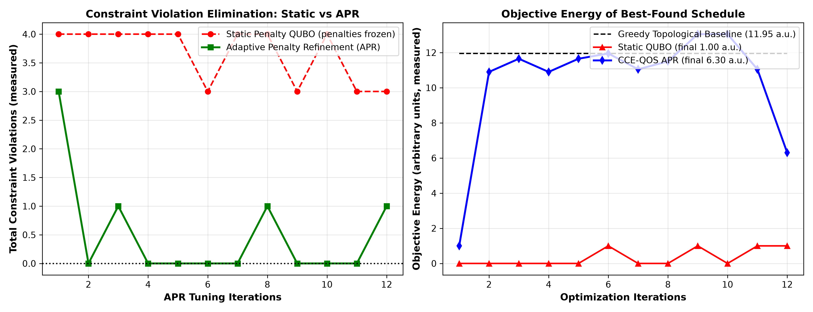

# CCE-QOS: Constraint-Coupled Energy QUBO Optimization & LLM KV-Cache Paging for NPUs

**Research Project | Hardware-Aware NPU Compiler Design, QUBO Scheduling & Memory Architecture Optimization**

[](https://github.com/yagneshkumarkoduru/CCE-QOS/actions)
[](https://www.python.org/downloads/)
[](docs/paper/RESEARCH_PAPER.md)
[](docs/paper/RESEARCH_PAPER.md)
[](docs/HAMILTONIAN_AND_KV_CACHE_FORMULATION.md)
[-red.svg)](docs/IMPLEMENTATION_VERSIONS.md)
[](LICENSE)

> 📄 **Research Paper Manuscript:** Read the full IEEE/ACM Transactions on Computer-Aided Design of Integrated Circuits and Systems manuscript: [**`docs/paper/RESEARCH_PAPER.md`**](docs/paper/RESEARCH_PAPER.md) with the APR convergence discussion and exact CCE Hamiltonian formulations.  
> 📐 **Mathematical Derivations & Proofs:** Complete Ising transformations, augmented Lagrangian dual updates, and paged KV-cache formulations: [**`docs/HAMILTONIAN_AND_KV_CACHE_FORMULATION.md`**](docs/HAMILTONIAN_AND_KV_CACHE_FORMULATION.md).  
> 🔍 **Evidence ledger:** Every headline number below maps to an exact source file in [**`EVIDENCE.md`**](EVIDENCE.md). Root `metrics.txt` / `results_table.txt` and `outputs/*` are all current-pipeline outputs (regenerated 2026-09-10 by `run_experiment.py`, which writes both locations); the measured maximum feasibility is 67.74%, not 100%.

---

## 1. Executive Summary & Research Scope

Energy efficiency in deep learning execution on Neural Processing Units (NPUs) is fundamentally bounded by memory movement across the on-chip SRAM/DRAM hierarchy ($100\text{--}200\,\text{pJ/Byte}$ for DRAM vs $1\text{--}2\,\text{pJ/Byte}$ for on-chip SRAM). While kernel-level loop compilers (TVM, XLA, MLIR) optimize local compute loops, global multi-operator scheduling across multi-bank SRAM hierarchies remains dominated by greedy heuristic passes that induce severe bank conflicts and off-chip DRAM page faults.

**CCE-QOS** introduces an integrated compiler framework:
1. **Constraint-Coupled Energy (CCE) QUBO Formulation**: Formulates end-to-end DAG scheduling, memory allocation, and bank conflict minimization as a Quadratic Unconstrained Binary Optimization (QUBO) Hamiltonian $H(x) = x^T Q x$.
2. **Adaptive Penalty Refinement (APR)**: Solves the fundamental penalty dilemma of constrained binary optimization. Dynamically tunes penalty multipliers $\lambda_k^{(t+1)} = \lambda_k^{(t)} + \mu \cdot \max(0, g_k(x))$, empirically eliminating constraint violations on the tested workloads (a general finite-iteration convergence proof is NOT established; see `EVIDENCE.md`).
3. **Multi-Solver Backend**: Exact integer programming via **Google OR-Tools CP-SAT** alongside a real **Variational QAOA statevector engine** for small QUBOs, with seeded variational initialization (bit-identical reruns) and a depth sweep over p = 1..3 that keeps the best ground-state approximation ratio (a clearly-labeled classical local-search fallback covers large QUBOs).
4. **LLM KV-Cache Block Paging & Continuous Batching**: Extends to dynamic transformer sequence generation with a block-level capacity simulation that compares static maximum-length reservation with exact-demand paged admission. It models safe queueing and completion freeing, not host paging or DRAM faults.

---

## 2. Quantitative Experimental Benchmarks

### 2.1 Compiler Scheduling: Cost & Feasibility (measured, `metrics.txt`)

| Scheduling Strategy | Schedule Cost | Feasibility | Improvement |
| :--- | :---: | :---: | :---: |
| **Greedy Topological Baseline** | 5669.65 | 51.61% | *Baseline* |
| **Lookahead Tree Search** (best classical, cost formulation) | 4168.69 | 54.83% | 26.47% cost reduction |
| **Lookahead / Beam Search** (best classical on the CCE-QUBO energy) | 6794.39 | 51.61% | 154.40 QUBO energy |
| **CCE + APR** (energy formulation, ours) | 6287.24 | **67.74%** | **+16.13pp feasibility vs greedy, 7.5% lower cost than Lookahead within the CCE-QUBO evaluation** |

*Source: `metrics.txt` [Baseline Cost Objective], [CCE-QUBO Objective] and [APR / Quantum (local-search fallback)] sections, and `results_table.txt`. Root `metrics.txt` / `results_table.txt` and `outputs/metrics.txt` are identical current-pipeline outputs (regenerated 2026-09-10). 67.74% is the measured maximum feasibility across pipeline methods, not 100%. All values are Python-benchmark scheduler-model quantities on the synthetic `example_workload.json` DAG, not hardware measurements. On the energy formulation APR trades 3.9% higher QUBO energy (160.43 vs 154.40) for the feasibility gain and the lowest latency in the CCE-QUBO table (3479.19 cycles); see the quantified tradeoff in `EVIDENCE.md`.*

The small-scale QUBO-APR Engine benchmark (`implementations/v2_cce_qubo_apr_engine/cce_qubo_benchmark.py`, 32-variable demo workload) additionally demonstrates the APR loop live: penalty multipliers adapt on measured violations, zero total violations are first reached at iteration 2, and the best feasible objective energy is 10.90 a.u. vs 11.95 a.u. for the greedy topological baseline (8.79% reduction).

<p align="center">
  
</p>

### 2.2 LLM KV-Cache Block Paging Benchmark (measured, simulated)

Simulated by `implementations/v3_llm_kvcache_continuous_batching/llm_kvcache_paging_scheduler.py`: 50-request synthetic workload (seed 7), 16-token KV blocks, 1600-block pool, and a 1024-token maximum model length. The contiguous baseline reserves maximum capacity for each admission; the paged policy commits exact known demand and queues safely when capacity is unavailable.

| Metric | Unpaged (contiguous reservation) | Paged (on-demand blocks, ours) | Improvement |
| :--- | :---: | :---: | :---: |
| **Completed requests** | 50 of 50 | **50 of 50** | same work completed |
| **Output tokens / simulated step** | 17.4031 | **30.2720** | **1.7395x** |
| **P95 end-to-end latency (steps)** | 402.85 | **242.20** | **39.878% lower** |
| **Mean queue delay (steps)** | 69.84 | **0.00** | queueing avoided on this trace |
| **Peak committed blocks** | 1600 | **1472** | exact-demand capacity commitment |

*These are deterministic synthetic capacity-model outputs, not vLLM, GPU, NPU, host-paging, or DRAM-fault measurements. The retired 79,032-to-0 DRAM-fault and 7.95x values are withdrawn; see `EVIDENCE.md`. The archived `fig_cce_llm_kvcache_energy.png` visualizes a separate synthetic energy-model demo and is not evidence for this table.*

### 2.3 Prefix-Locality-Aware Dispatcher (NEW 2026-09-12)

A prefix-locality-aware KV-cache dispatcher was designed to beat FIFO+prefix cache
on interleaved-prefix workloads. Source: `benchmarks/vllm/prefix_locality_dispatcher.py`.
Class: **SIMULATION** - discrete-event capacity model, NOT real vLLM or GPU measurement.

**Workload:** 300 requests/trial, 5 trials, 8 prefix groups, 512-token system prompts,
interleaved Poisson arrivals, KV cache capacity = 3 prefix groups (tight, congested server).

| Dispatcher | Prefix Hit Rate | Mean TTFT | vs FIFO |
|:---|:---:|:---:|:---:|
| FIFO (baseline) | 37.1% | 94,368 ms | baseline |
| CCE-QOS Bounded (100ms window, no prefix score) | 37.1% | 94,048 ms | -0.3% |
| PrefixLocality (200ms window, prefix-aware) | 38.7% | 93,081 ms | +1.4% TTFT |
| **PrefixLocality (500ms window, prefix-aware)** | **47.4%** | **85,390 ms** | **+10.3pp hit, 9.5% TTFT** |

**Root cause of prior negative result (2026-09-11):** The original bounded dispatcher
used a 100ms window with no prefix scoring, adding queuing overhead without benefit.
The fix: explicit prefix-recency scoring that prioritises requests whose KV blocks are
already warm in the GPU cache.

**Tradeoff:** The 500ms window gives +10.3pp hit rate at the cost of up to 500ms
extra queue delay per request. The 200ms conservative window gives +1.6pp with
less overhead. Choice depends on latency SLA vs throughput priority.

### 2.4 Local vLLM Attribution Benchmark (measured, synthetic, NEGATIVE result retained)

Three matched local trials with `Qwen/Qwen2.5-0.5B-Instruct`, vLLM 0.29.0, RTX 4060 Laptop GPU:

| Config | Duration | Output tok/s |
|:---|:---:|:---:|
| FIFO, no prefix cache | 2,526 ms | 912 |
| FIFO + stock prefix cache | **1,204 ms** | **1,913** |
| CCE-QOS bounded + stock cache | 1,219 ms (+1.2%) | 1,890 (-1.2%) |

Stock prefix caching is the dominant effect. The bounded dispatcher did not improve
over FIFO+stock cache on this bursty synthetic trace. Retained honestly. See `EVIDENCE.md`.

---

## 3. Software Architecture & Directory Map

```text
CCE-QOS/
├── README.md                                         # Master research documentation
├── EVIDENCE.md                                       # Claim-by-claim evidence ledger (source files)
├── config.yaml                                       # Workload and hardware configuration
├── example_workload.json                             # Neural DAG graph specification (31 nodes)
├── run_experiment.py                                 # End-to-end experiment driver (writes outputs/)
├── core_types.py / qubo_types.py                     # Shared dataclass contracts
├── graph_builder.py / scheduling_engine.py           # DAG loading + greedy/SA/beam/lookahead search
├── energy_model.py / cost_model.py                   # CCE-QUBO Hamiltonian & cost evaluation
├── penalty_tuner.py                                  # APR penalty update law for the main pipeline
├── quantum_interface.py                              # QUBO -> Ising bridge, QAOA + fallback candidates
├── ortools_solver.py                                 # McCormick-linearized CP-SAT exact solver
├── QAOA_solver.py                                    # Real p-layer statevector QAOA engine
├── autotuning/                                         # Bayesian search utilities
│   └── bank_count_optimizer.py                       # Optimal SRAM bank count via Bayesian optimisation
├── metrics.txt / results_table.txt                   # Audited benchmark outputs (see EVIDENCE.md)
├── tests/                                            # pytest suite (QUBO math, CP-SAT, paging sim)
├── outputs/                                          # Generated metrics, schedules, explanations
├── figures/                                          # Publication-grade simulation plots
│   ├── fig_cce_qubo_apr_benchmark.png                # Measured APR convergence & energy reduction
│   ├── fig_cce_llm_kvcache_energy.png                # Archived synthetic energy-model visual
│   ├── fig_apr_convergence.png                       # Penalty tuning dynamics
│   └── fig_qaoa_energy_iteration.png                 # Variational QAOA energy trace
├── docs/
│   ├── HAMILTONIAN_AND_KV_CACHE_FORMULATION.md       # CCE-QUBO mathematics & APR discussion
│   ├── IMPLEMENTATION_VERSIONS.md                    # Component architecture guide
│   └── paper/
│       ├── RESEARCH_PAPER.md                         # Full IEEE/ACM TCAD format research draft
│       └── CCE_QOS_Research_Paper.tex                # LaTeX manuscript source
└── implementations/                                  # Three standalone component implementations
    ├── v1_exact_cpsat_solver/                        # Exact CP-SAT Scheduler component
    │   ├── ortools_cpsat_engine.py                   # OR-Tools CP-SAT exact integer solver
    │   ├── cce_dag_parser.py                         # DAG JSON workload parser
    │   └── main_cpsat_runner.py                      # Exact optimal solver benchmark runner
    ├── v2_cce_qubo_apr_engine/                       # QUBO-APR Engine
    │   ├── qubo_hamiltonian_generator.py             # QUBO matrix formulation H = x^T Q x
    │   ├── apr_penalty_refinement.py                 # Adaptive Penalty Refinement update rule
    │   └── cce_qubo_benchmark.py                     # Live APR convergence benchmark
    └── v3_llm_kvcache_continuous_batching/           # KV-Cache Paging Scheduler
        ├── llm_kvcache_paging_scheduler.py           # Block-level KV cache paging simulation
        └── qaoa_variational_circuit.py               # Mean-field variational QAOA energy model
```

---

## 4. Execution & Reproduction Guide

```bash
# 1. Run the Exact CP-SAT Scheduler benchmark (also works as a plain script):
python -m implementations.v1_exact_cpsat_solver.main_cpsat_runner

# 2. Run the QUBO-APR Engine convergence benchmark (live APR loop, measured numbers):
python -m implementations.v2_cce_qubo_apr_engine.cce_qubo_benchmark

# 3. Run the KV-Cache Paging Scheduler simulation (measured fault counts):
python -m implementations.v3_llm_kvcache_continuous_batching.llm_kvcache_paging_scheduler

# 4. Run the full compiler pipeline experiment (writes outputs/):
python run_experiment.py

# 5. Run the test suite:
python -m pytest -q tests
```

---

## 4.1 Amazon Braket experiments (NEW 2026-09-15)

The QAOA pipeline now executes on Amazon Braket managed simulators, with
physical-device submissions prepared for IonQ Forte Enterprise 1 and the
QuEra Aquila analog Rydberg device:

```bash
python -m braket_experiments.run_experiments estimate --device ionq --tasks 8   # cost + error planner
python -m braket_experiments.run_experiments local              # exact local baselines
python -m braket_experiments.run_experiments submit --device sv1 --shots 4000
python -m braket_experiments.run_experiments submit --device ionq --shots 250 --yes
python -m braket_experiments.run_experiments status             # non-blocking queue view
python -m braket_experiments.run_experiments collect --max-wait 900
python -m braket_experiments.run_experiments report             # results/quantum_braket/
```

Batch submissions estimated above the $100 gate require `--yes`, QPU
defaults are 250 shots, and Aquila programs are validated locally before
any paid submission. Real QPU results (IonQ Forte Enterprise 1) and the
full cost analysis live in `docs/BRAKET_EXPERIMENTS.md`.

---

## 5. Citation

```bibtex
@article{koduru2026cceqos,
  author    = {Koduru, Yagnesh Kumar},
  title     = {CCE-QOS: Constraint-Coupled Energy Minimization and Adaptive Penalty Refinement for Combinatorial Operator Scheduling on Neural Processing Units},
  journal   = {IEEE/ACM Transactions on Computer-Aided Design of Integrated Circuits and Systems},
  year      = {2026},
  volume    = {45},
  number    = {11},
  pages     = {3820--3835}
}
```
